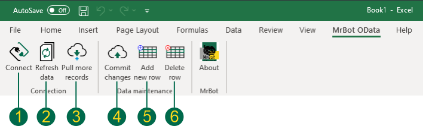
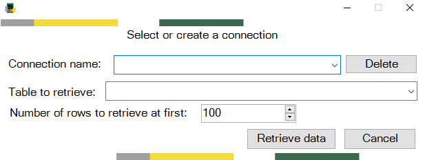
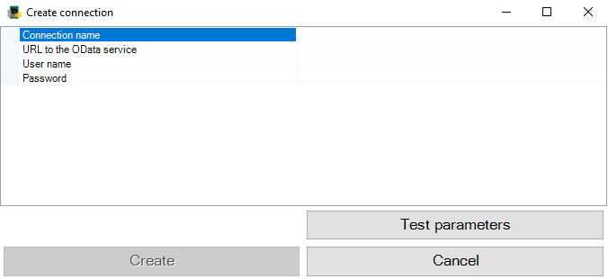
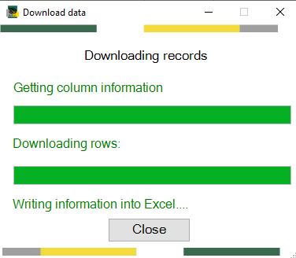
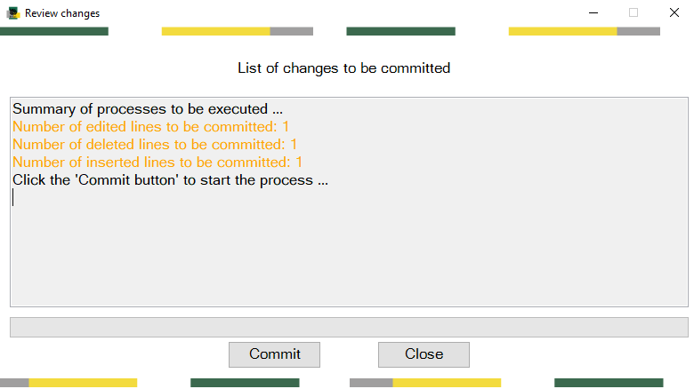

# MrBot OData Excel Add-in
This is an open source Excel Add-in for accessing OData V2 and V4 producers. MrBot OData Excel Add-in supports all CRUD operations if the producer supports them.

Other features are:

- Support basic authentication
- Download data in batches
- Different connections per sheet
- Data changes and connection settings are stored off-line in the Excel file

Use the [MSI Installer](https://github.com/mrbotcr/MrBot-OData-Client/raw/Version2.0/MrBotAddIn-Setup/Release/MrBotAddIn-Setup.msi) to the install the Add-in.

## Documentation

### The MrBot OData Toolbox

After you install the add-in you will see the MrBot OData Toolbox in the main menu of Excel.

1. Connect. Create a new connection to an OData service URL.
2. Refresh data. This will pull any changes made to the resource.
3. Pull more records. The add-in pulls records in batches (100 rows by default). This action will pull more records if there are any.
4. Commit changes. This will show you any changes made to the data.
5. Add new row. This will add a new row at the end of the sheet.
6. Delete row. This will mark the row for deletion.

### Manage connections

- To create a new connection pull down the connection combo box and select "new".

  

  - Set a name to the connection. Paster the URL to the OData service and indicate an user name and password.
  - Click on the "Test parameters" button to check the connection.
  - Click on the "Create" button to save the connection.

- To delete a new connection click on the "Delete" button.

- Select the table that you want to retrieve and the number of initial rows. Then click on the "Retrieve data" button. The add-in will pull the data from the on line OData service. Once the data is downloaded click on the "Close" button

  

### Manage changes

The add-in keeps track of any changes made to the data. To commit changes click on the action "Commit changes". The changes window will appear.

- Click on the "Commit" button to push the changes to the OData service. This action will only work if the service allow CRUD operations and if your user account has such privileges.

## Contribute

MrBot OData Excel Add-in is released under GPL V3. You can modify the code using [Visual Studio 2019 Community Edition](https://visualstudio.microsoft.com/vs/community/). You also need to install the [Microsoft Visual Studio Installer Projects Extension](https://marketplace.visualstudio.com/items?itemName=VisualStudioClient.MicrosoftVisualStudio2017InstallerProjects). Please contribute by posting issues or pull requests.

